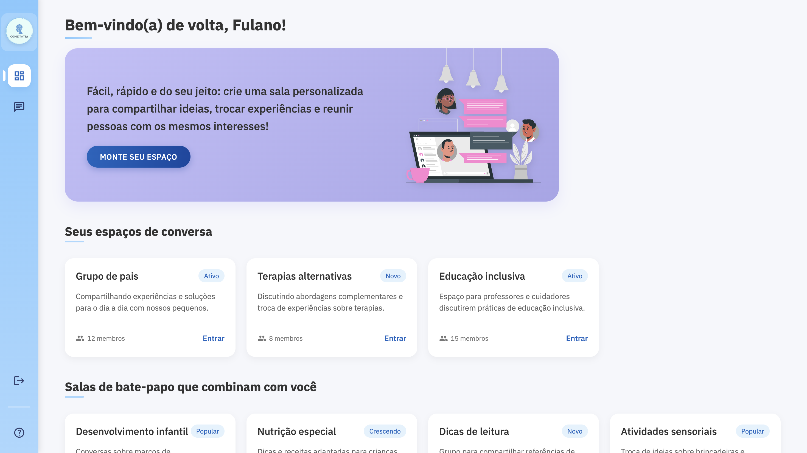
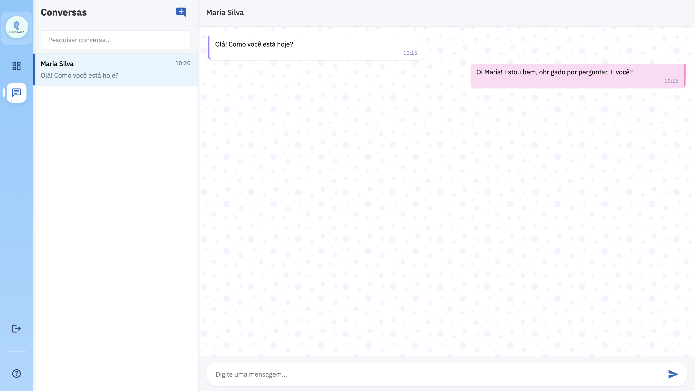
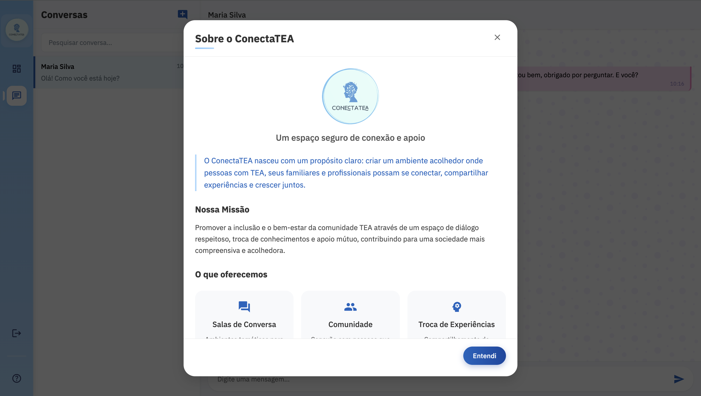
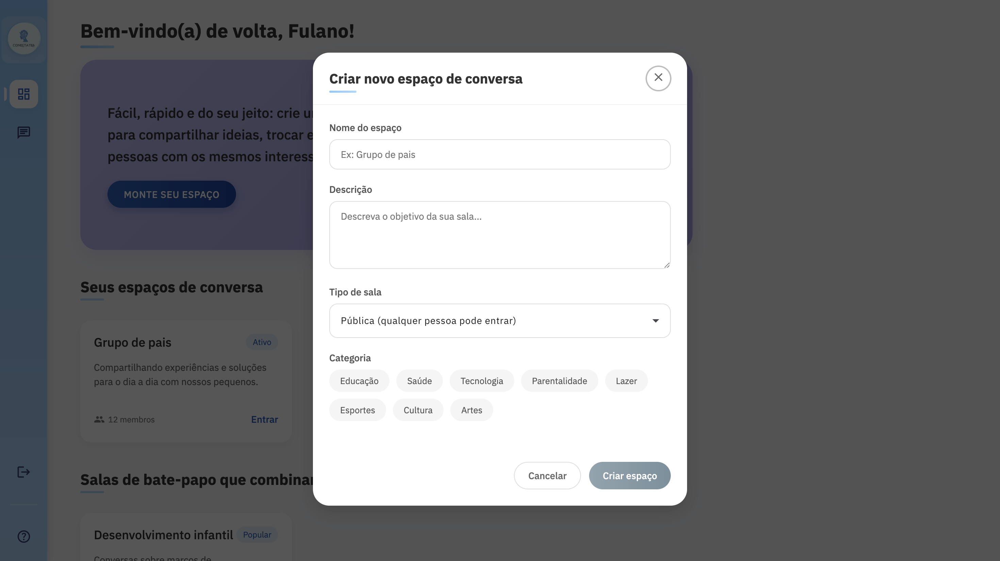
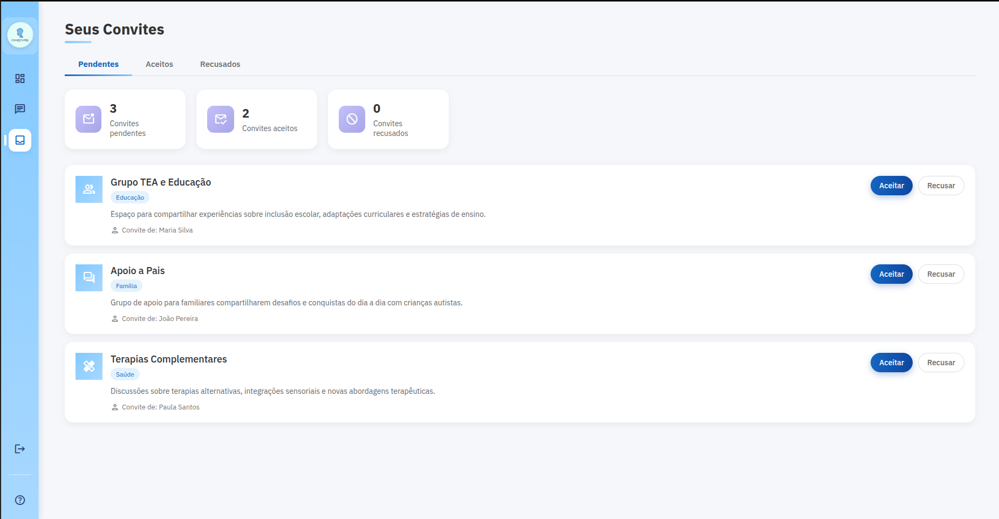

# ConectaTEA

## 📖 Sobre o projeto

ConectaTEA é uma plataforma de bate-papo especializada para pessoas com Transtorno do Espectro Autista (TEA), focada na criação de salas de conversa seguras e acessíveis. A plataforma oferece um ambiente virtual para comunicação, promovendo a inclusão e o bem-estar de pessoas com TEA.

---

## 🔧 Estrutura do projeto

O projeto é composto por várias partes, cada uma com suas responsabilidades:

- **👨‍💻 Front-End**: Responsável pela interface do usuário, desenvolvido com **Angular** e **TypeScript**.
- **💻 Back-End**: API construída com **Java Spring Boot**, que gerencia as salas de conversa, usuários e lógica do chat.
- **🗄️ Banco de dados**: **PostgreSQL** para armazenamento de dados persistentes e **Redis** para cache.
- **🚀 Infraestrutura**: Utiliza **Docker** para facilitar o processo de desenvolvimento e deploy.

## 💡 Funcionalidades

## 🖥️ Front-End 
- ### 📸 Dashboard

- ### 💬 Chat

- ### Sobre

- ### Crie espaços de conversa

- ### Acompanhe seus convites pra ocupar espaços de conversas

---
